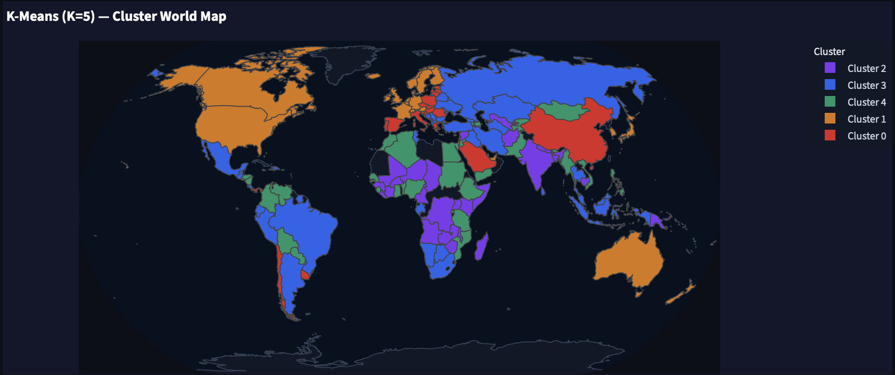
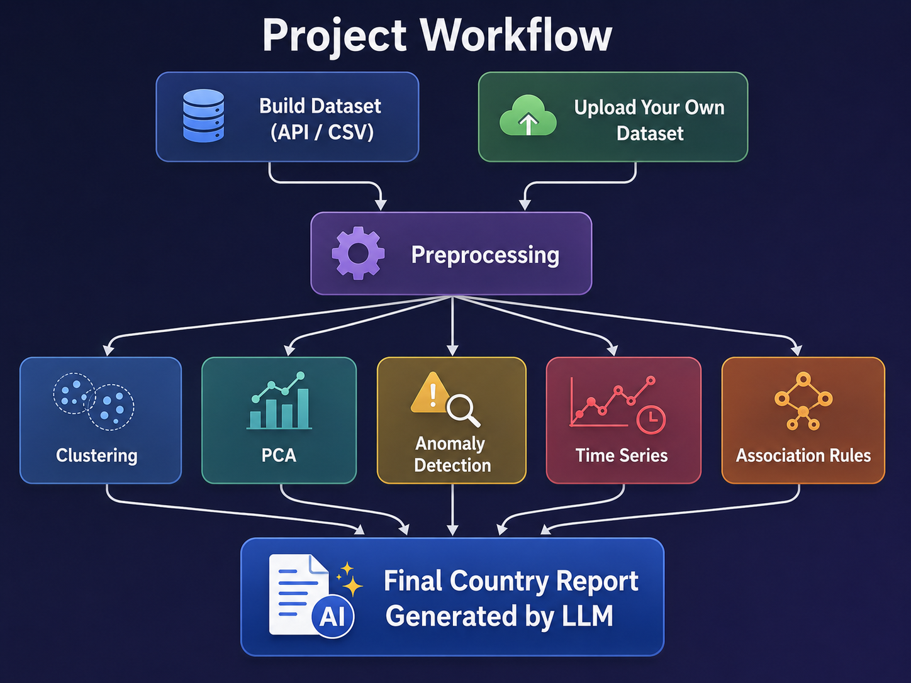
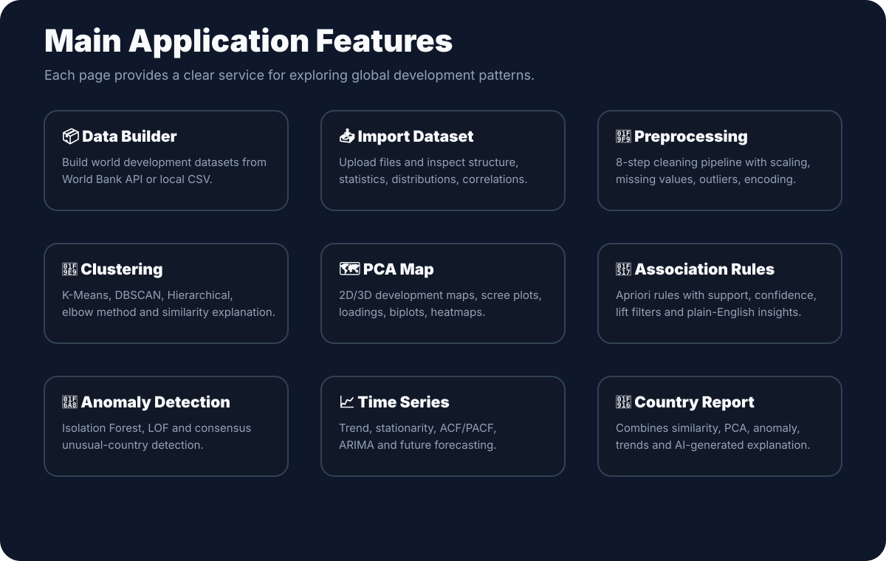

# 🌍 World Development Dashboard



An interactive **data mining application** for exploring how countries develop over time economically, socially, technologically, politically, and environmentally.  
The system helps users build or import a world development dataset, clean it, analyze hidden patterns, visualize countries on maps, detect unusual countries, forecast future indicator values, and generate country-level intelligence reports.

#### **Team:** Bilal Anabosi, Yaqoob Hanbali, Mohammad Sayeh  
#### **Course:** Data Mining 10672349  
#### **University:** An-Najah National University
---

##  Table of Contents

- [Project Idea](#-project-idea)
- [System Workflow](#-system-workflow)
- [Features](#-main-features)
- [Data Mining Techniques](#-data-mining-techniques-used)
- [How to Run](#️-installation-and-setup)
- [Strongest Feature](#-strongest-feature)
- [Final Summary](#-final-summary)

---


##  Project Idea

The project is a **Global Development & Well-being Intelligence Platform**. Instead of showing only raw indicators, it transforms country-level data into useful insights:

- Which countries are similar to each other?
- What development indicators explain the difference between countries?
- Which countries are unusual or outperforming/underperforming compared with others?
- What patterns appear between social, economic, health, education, and technology indicators?
- How has a selected country changed over time?
- What could happen in future years based on historical trends?

The application is designed for users who want to understand global development data without writing code.

---

##  System Workflow



The normal workflow is:

1. **Build or import a dataset** using the World Bank API, included CSV data, sample datasets, or an uploaded file.
2. **Preprocess the data** using the 8 steps cleaning pipeline.
3. **Run data mining pages** such as clustering, PCA, association rules, anomaly detection, and time series forecasting.
4. **Generate reports and download outputs** such as CSV files and Markdown country reports.

---


##  Main Features



---

##  Data Mining Techniques Used


| Technique | Where It Is Used | Purpose |
|---|---|---|
| K-Means | Country Similarity page | Group countries into development clusters |
| DBSCAN | Country Similarity page | Find density-based groups and possible noise points |
| Hierarchical Clustering | Country Similarity page | Show country relationships using a dendrogram |
| PCA & SVD| Development Map page | Reduce many indicators into 2D/3D visual maps |
| Apriori | Pattern Rules page | Discover relationships between indicator categories |
| Isolation Forest | Unusual Countries page | Detect unusual country profiles |
| Local Outlier Factor | Unusual Countries page | Detect local outliers compared with neighbors |
| ARIMA | Trends Over Time page | Forecast future indicator values |


---

##  Installation and Setup

### 1. Open the project folder

### 2. Create a virtual environment

On macOS/Linux:

```bash
python3 -m venv .venv
source .venv/bin/activate
```

On Windows:

```bash
python -m venv .venv
.venv\Scripts\activate
```

### 3. Install dependencies

```bash
pip install -r requirements.txt
```

Optional AI features use Groq. If the Groq package is not installed, install it with:

```bash
pip install groq
```

### 4. Configure optional AI features

The app can run without AI. For AI-generated cluster names, anomaly explanations, and country reports, create a `.env` file in the project root:

```env
GROQ_API_KEY=your_groq_api_key_here
GROQ_MODEL=llama-3.3-70b-versatile
```

### 5. Start the app

```bash
streamlit run app.py
```

After running the command, Streamlit will open the dashboard in your browser.

---


## Strongest Feature

The strongest feature of the project is the **Country Intelligence Report**.

It is strong because it does not depend on only one technique. It combines:

- Country similarity results.
- Indicator profile comparison.
- PCA position.
- Anomaly status.
- Time-series evidence.
- AI-generated explanation.

This makes the system feel like a practical intelligence tool, not just a collection of charts.

---

## Real-World Example Scenarios

### Scenario 1: Student or researcher comparing countries

A user selects several indicators such as GDP per capita, life expectancy, internet usage, education, and population. The clustering page shows which countries are similar and the PCA page explains which indicators separate them.

### Scenario 2: NGO looking for unusual development profiles

An NGO can use anomaly detection to find countries that do not follow expected development patterns, such as strong economic indicators but weak health or education outcomes.

### Scenario 3: Policy analyst studying future trends

A policy analyst can select a country and indicator, inspect historical changes, test stationarity, and generate ARIMA forecasts for future years.

---

## Final Summary

The **World Development Dashboard** is a complete data mining system that turns raw country indicators into meaningful insights. It allows users to build data, clean it, analyze country similarity, reduce dimensions, discover rules, detect anomalies, forecast trends, and generate readable country reports. The project demonstrates how data mining can become a practical, user-friendly service for understanding global development.
